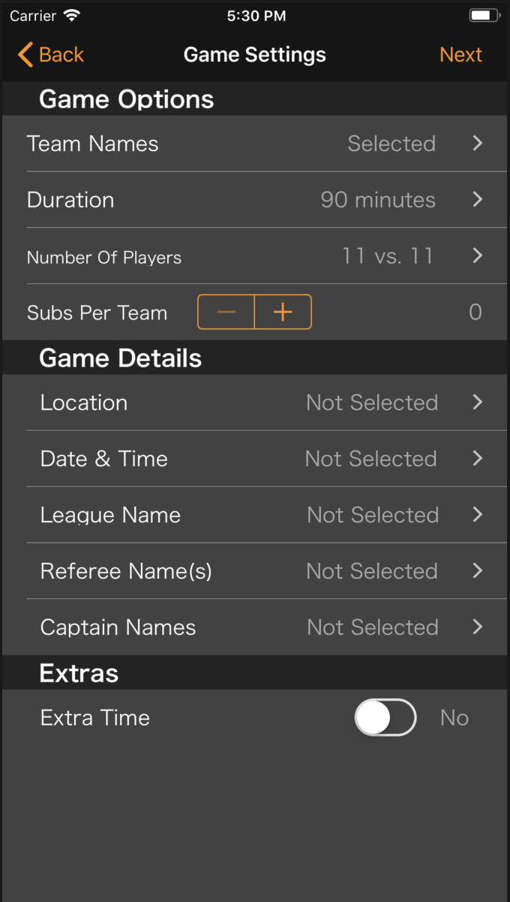

# RefCard
## Overview
RefCard is an app for the soccer referee. It help the user to keep up with the match. An active screen provides the referee quick and easy access to substitutions, red and yellow cards, goals, the current score and the running time of the game.

## Key Features
*  User sign up and login - Each user has a database of statistics (Eg. total number of red cards) and info of all previous matches
*  Save for later - The user has the option to create a match and save it for later use
 Match customization - Change number of players, duration, number of substitutions, etc

## To-Do
Light mode
Translate to Spanish
